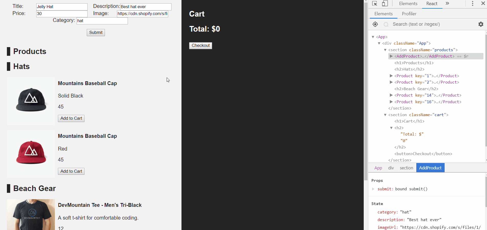
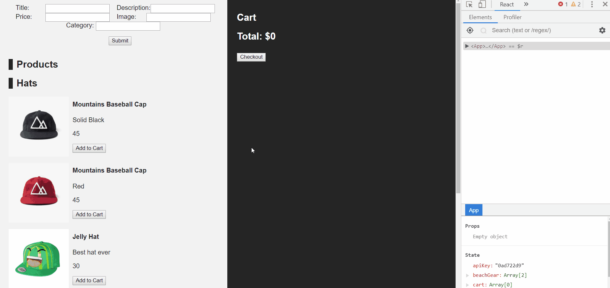
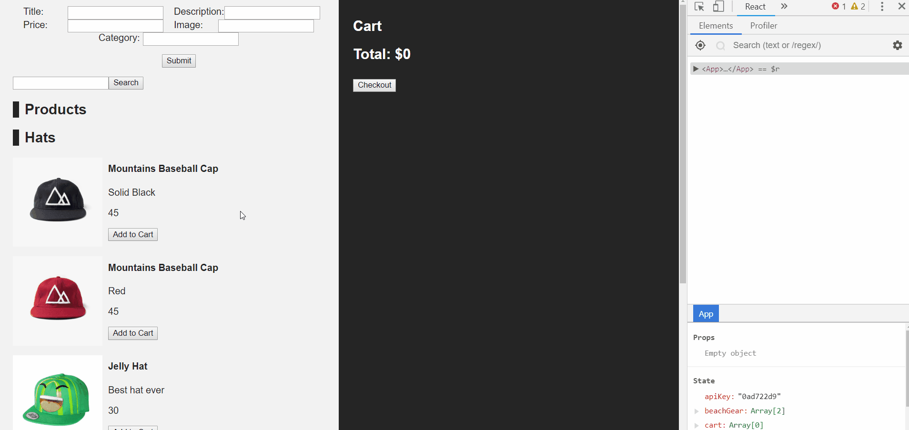

# Project Summary

<p>In this project we will create an e-commerce React application from start to finish. </p>

This project is a continuation from previous projects. If you are wanting to do this project then start with <a href="https://github.com/DevMountain/react-1-1"> this repo</a> first.

# Day 3

Today we will be focusing on making HTTP requests using the Axios library. We will gain some experience working with third-party API's, by retrieving an API key and using it to validate our HTTP requests. After completing this project, you should have a better understanding of the following concepts:

- Axios
- HTTP Requests
- React Lifecycle Methods

# Live Example


<a href="https://devmountain.github.io/react-1-3/">Click Me!</a>

## Setup

- For this project you will be continuing the Day 2 project.
- You should have completed Day 2 Part 2 in order to begin today's project.
- We will be using two separate API's for today project. You will need to refer to these through out the project.
  - <a href="https://r3products.devmountain.com/"> Products </a>
  - <a href="https://r3payments.devmountain.com/#/"> Payments </a>

# Part 1

### Summary

In this part we will use `axios` in the `componentDidMount` lifecycle method of `App.js`, to get a list of products from the API. We will refer to the documentation for this API, to tell us how to format our axios requests. We will also be able to add new items to the products API server. In order to access the server, we will have to request an `API key`. This is a common practice for public API's; requiring users to provide a personal API key so that they can validate, control and track who has access to their servers. In the case of our products API, this API key needs to be applied to all http requests as a query parameter called `key`.

## Step 1

- Run `npm install axios` in your project root directory, to install the `axios` package.
- Import `axios` in `App.js`, at the top of the file, like so: `import axios from "axios";`
- We will be using products from the API instead of the local ones, so delete the products you hard coded into your `App.js`
- Create a `componentDidMount` method on the `App` component.
- In the `componentDidMount`, we will make an axios request to get a list of products from the server. Refer to the API docs for how to format your axios request. <a href="https://r3products.devmountain.com/"> Products API Docs </a>
- In order to use the API, an `API key` is required. Use `Postman` to request an `API key` from the products server.

  - This will be a `GET` request. The API docs will tell you how to format the request.
  - Once you have a key, type it onto state in your constructor function in your App.js.

<details><summary> Detailed Instructions </summary>

Let's begin by opening `src/App.js` and creating a `componentDidMount` method after the `constructor` but before the `render` method. We will Also want to add one more property onto state called apiKey, we will get use postman to get the API Key.

Open the Postman app and put this URL into the search bar: `https://r3payments.devmountain.com/payment/key`.

This is what postman should look like after you run the request. You will need to get your own API key, don't use the one included in the picture.


```js
constructor(){
  props()
  this.state = {
    apiKey: '<<API key that you got using postman>>'
  }
}
componentDidMount() {
  // axios request will go here
}
```
</details>

## Step 2

- Now we need to get the list of products from the API, using the API key that we have just acquired.

<details> <summary> example code </summary>

```js
componentDidMount() {
  axios.get(`http://r3products.devmountain.com/products?key=${this.state.apiKey}`)
    .then( productsResponse => {
      // ...do something with the response
    })
}
```

</details>

- The products API will give us a list of items. In order to keep track of the quantity of an item in the cart, each item needs to have a `quantity` value initialized to 0.

  - Use a `forEach` or for loop, to add a `quantity` value, which defaults to 0, to each item returned from the API.

    <details> <summary> example code </summary>

    ```js
    axios
      .get(`http://104.248.178.153/products/catalog?key=${this.state.apiKey}`)
      .then(productsResponse => {
        productsResponse.data.forEach(item => (item.quantity = 0));
        // ...
      });
    ```

    </details>

- The product API will give us data sorted by category of `hat` or `beach gear`. We need to sort this response data, and put it on matching objects on state.

  - In order to do this, we can filter the result object by the item category.

    <details> <summary> example code </summary>

    ```js
    let hats = productsResponse.data.filter( item => item.category === "hat");
    let campingGear = productsResponse.data.filter(item => item.category === "camping gear");

    // now that we have this data sorted into categories, we can set these on state
    this.setState({
      hats: hats,
      campingGear: campingGear
    });
    ```

    </details>

### Solution

<details> 
<summary> <code> App.js </code> </summary>

Modify componentDidMount, to also hit the products endpoint, to get all products (according to the [API docs](https://r3products.devmountain.com/)).

```js
componentDidMount() {
  axios.get(`https://r3products.devmountain.com/products/catalog?key=${this.state.apiKey}`)
    .then( productsResponse => {
      // we also need to add a quantity to the each product item
      productsResponse.data.forEach( item => item.quantity = 0 );

      // here we need to sort the resulting product data by category
      let hats = productsResponse.data.filter( item => item.category === "hat" );
      let campingGear = productsResponse.data.filter( item => item.category === "camping gear" );

      // now that we have this data sorted into categories, we can set these on state
      this.setState({
        hats: hats,
        campingGear: campingGear
      });
    })
}
```

</details>

## Step 3

- Create a file in `src/components/` called `AddProduct.js`.
- This component should be able to store the following data on state: `title`, `description`, `price`, `imageUrl` and `category`.
- These should be initialized as empty strings.
- Create a text input field for each of these state values. The text input should be able to update its value on state.

  - In order to do this, for the name input field, we can create a method called `handleTitle`, which will accept a string value, and call `setState` to update the `name` value on state.

    <details> <summary> example code </summary>

    ```js
    handleTitle(title) {
      this.setState({ title: title })
    }
    ```

    ```js
    <input type="text" value={this.state.title} onChange={ (event) => this.handleTitle(event.target.value) } />
    ```

    </details>

  - The name input field should have a `value` attribute set to `this.state.title, so that it always accurately displays the corresponding value on state.
  - Do this for all five input fields, creating a method for each of them, like `handleTitle`, `handleDescription`, `handlePrice`, `handleImage` and `handleCategory`.

- Create a `submit` button. This button should submit the data for the new item, by calling a function which will be passed from the `App` component as a prop in the next step.

  <details> <summary> example code </summary>

  ```js
  // on AddProduct.js
  submit() {
    const newItem = {
      title: this.state.title,
      description: this.state.description,
      price: this.state.price,
      imageUrl: this.state.image,
      category: this.state.category
    }
    this.props.submit(newItem)
  }
  ```

  ```js
  <button onClick={ () => this.submit() }> submit </button>
  ```

  </details>

- Make sure to label your input fields with a `label` tag, so that the user knows which field he is updating.

### Solution

<details>
<summary> <code> AddProduct.js </code> </summary>

```js
import React, { Component } from 'react';

export default class AddProduct extends Component {
  constructor(props) {
    super(props);
    this.state = {
      title: '',
      description: '',
      price: '',
      imageUrl: '',
      category: '',
    };
  }

  handleTitle(title) {
    this.setState({
      title,
    });
  }

  handleCategory(category) {
    this.setState({
      category,
    });
  }

  handleDescription(description) {
    this.setState({
      description,
    });
  }

  handlePrice(price) {
    this.setState({
      price,
    });
  }

  handleImage(imageUrl) {
    this.setState({
      imageUrl,
    });
  }

  submit() {
    const newItem = {
      title: this.state.title,
      description: this.state.description,
      price: this.state.price,
      imageUrl: this.state.imageUrl,
      category: this.state.category,
    };
    this.props.submit(newItem);
  }

  render() {
    const { title, description, price, imageUrl, category } = this.state;
    return (
      <div>
        <label>Title: </label>
        <input onChange={e => this.handleTitle(e.target.value)} value={title} />
        <label>Description: </label>
        <input onChange={e => this.handleDescription(e.target.value)} value={description} />
        <label>Price: </label>
        <input onChange={e => this.handlePrice(e.target.value)} value={price} />
        <label>Image: </label>
        <input onChange={e => this.handleImage(e.target.value)} value={imageUrl} />
        <label>Category: </label>
        <input onChange={e => this.handleCategory(e.target.value)} value={category} />
        <button onClick={() => this.props.submit()}> Submit </button>
      </div>
    );
  }
}

```

</details>

## Step 4

- Create a `submit` method in `App.js`.
- This method should accept one argument, an `object` with a name, description, price and image value.
- This method should submit a new product to the products API, using an axios `POST` request. Refer to the [API docs](https://r3products.devmountain.com/) for how you should format this request.
  - Remember to append your API key onto the request URL as a URL query parameter.
  - e.g. `/product/catalog?key=${this.state.apiKey}`
- The resulting data from the post request will be a complete list of products, including the newly added item; use this result data to update the products on state.
  - To filter the products and put them on state, you can refer to the code in `componentDidMount`, where we first got the list of products.

### Solution

<details>
<summary> <code> src/App.js </code> </summary>

```js
submit (product) {
 axios.post(`https://r3products.devmountain.com/products/catalog?key=${this.state.apiKey}`, product)
    .then( productsResponse => {
      // we also need to add a quantity to the each product item
      productsResponse.data.forEach( item => item.quantity = 0 );

      // here we need to sort the resulting product data by category
      let hats = productsResponse.data.filter( item => item.category === "hat" );
      let campingGear = productsResponse.data.filter( item => item.category === "camping gear" );

      // now that we have this data sorted into categories, we can set these on state
      this.setState({
        hats: hats,
        campingGear: campingGear
      });
    })
}
```

</details>

## Step 5

- Import `AddProduct.js` into `App.js`.
  - Use `<AddProduct />` in the render method of `App`, and pass it the prop `submit` being equal to `this.submit`. e.g. `<AddProduct submit={ this.submit } />`
- Bind the `submit` method on App in the constructor function, so that it will have the right `this` context (`this` needs to refer to the App component).

### Solution

<details> 
<summary> <code> App.js </code> </summary>

```js
import AddProduct from "./components/AddProduct";

export default class App extends Component {
  constructor() {
    super();

    this.state = {
      /* ... */
    };

    this.submit = this.submit.bind(this);
  }

  submit() {
    // ...
  }

  render() {
    return (
      <div className="App">
        <AddProduct submit={this.submit} />
        {/* ... */}
      </div>
    );
  }
}
```

</details>



# Part 2

### Summary

In this part we will be changing up the way we handle the cart. All of the cart will be stored on the API server, and we will have to use HTTP requests to add or remove items from the cart.

## Step 1

- The `addToCart` method on `App.js` should be refactored to make an axios `POST` to the appropriate endpoint (refer to the [API docs](https://r3products.devmountain.com) for formatting the URL).
  - `addToCart` should take one argument, an item Id, which will be used in the axios call.
    - You will need to change it in `Product.js` to pass in just the id instead of the whole object.
  - Chain a `.then` onto axios post request.
  - In the `.then` callback function, set the response data to the `cart` value on state.

### Solution

<details>
<summary> <code> App.js </code> </summary>

```js
addToCart( itemId ) {
  axios.post(`https://r3products.devmountain.com/products/cart/${itemId}?key=${this.state.apiKey}`)
    .then(cartResponse => {
      this.setState({ cart: cartResponse.data })
    })
}
```

</details>



## Step 2

- If you haven't already mad the method to remove an item from the cart then you will need to do that. But we will be using `axios` instead of `setState`.
- Make the method and bind it to the App.`js`, then pass it down as prop to the `CartItem.js` component.
- Refer to the [API docs](https://r3products.devmountain.com) on which endpoint to hit.
- Chain a `.then` onto the request to set the resulting data onto the `cart` value on state.

### Solution

<details>
<summary> <code> App.js </code> </summary>

```js
removeFromCart( itemId ) {
  axios.delete(`https://r3products.devmountain.com/products/catalog/${itemId}?key=${this.state.apiKey}`)
    .then( cartResponse => this.setState({ cart: cartResponse.data }))
}
```

</details>

# Part 3

### Summary

In this part we will create a reusable button component, and then replace all of the buttons in our app with this component. The purpose of this exercise is to give you practice using a small, reusable component.

## Step 1

- Create a `Button.js` file.
- In this file, create a functional component as the default export.
  - A functional component still uses `import React from 'react'`, but does not import `{ Component }`.
- Also `import PropTypes from "prop-types"`
- Create a propTypes object for this component.
  - This component should expect two values on props: a function called `handleClick` and a string called `text`.

### Solution

<details>
<summary> <code> Button.js </code></summary>

```js
import React from 'react';
import PropTypes from 'prop-types';

function Button (props) {
  return (
    // empty for now
  )
}

Button.propTypes = {
  handleClick: PropTypes.func.isRequired,
  text: PropTypes.string.isRequired
}
```

</details>

## Step 2

- Now create the JSX for the Button component. It should return a button element.
- The `onClick` for this element should be the function passed in on props.
- It should display the text passed in on props.

### Solution

<details> <code> Button.js </code> </button>

```js
function Button(props) {
  return (
  <button onClick={props.handleClick}> 
    {props.text} 
  </button>
  );
}
```

</details>

## Step 3

- Now go through your application and where ever you are using regular `button` elements, replace them with our new, custom `Button` component. Remember that this custom component takes the `text` string as a prop, as well as a function on `handleClick`.

# Part 4 - Black Diamond

### Summary

In this part we will be creating a search function to query the API with a name string and get specific results. If you created the search function as part of Day 2 Black Diamond, you will need to refactor it to use the API. We will also be using a [payment API](https://r3payments.devmountain.com/#/) to process user payments.

## Step 1

- Create an `input` box on App of type `text`, that will take in user input in order to filter the list of products from the server.
- Create a value on state called `searchInput`. This will represent the value that the user has typed into our search input box.
  - Give the search input box a `value` attribute, equal to the `searchInput` value on state. (`this.state.searchInput`)
- Add a button under the search input box that will activate the `handleSearch` method on click (Use the component button you made).
- We will write the `handleSearch` function in the next step.

### Solution

<details> 
<summary> <code> App.js </code> </summary>

```js
<input type="text" />

<Button
  handleClick={this.handleSearch}
  text={"search"}
  value={this.state.searchInput}
/>
```

</details>

## Step 2

- Create a `handleSearch` method on App.
- It should make a get request to the API for the products with the `query parameter` of the user `search input`.
- Filter the results into category arrays to be stored on state, just as we have done when we get the products list in `componentDidMount`

### Solution

<details> 
<summary> <code> App.js </code> </summary>

```js
handleSearch() {
  axios.get(`https://r3products.devmountain.com/products/catalog?key=${this.state.apiKey}&name=${this.state.searchInput}`)
    .then(productsResponse => {
      // filter results onto arrays
      let hats = productsResponse.data.filter(item => item.category === "hat");
      let beachGear = productsResponse.data.filter(item => item.category === "beach gear");

      this.setState({
        hats: hats,
        beachGear: beachGear
      });
    })
}
```


</details>


## Step 3

- Now we are going to use another API to process the user's payment when they checkout.
  - Payment API docs: https://r3payments.devmountain.com/#/
- In order to use the Payment API, we will need to request a separate api key.

  - Do this using `Postman`, and store the value on App's state manually

    <details><summary> Detailed  Instructions </summary>

    ```js
    constructor(){
      super()

      this.state = {
        paymentApiKey = '<<key you get from making get request with postman for payment api key>>'
        //...
      }
    }
    ```

    </details>

## Step 4

- If you haven't already you will need to create inputs in the cart section to handle taking in a credit card number and an address.
- Then, in our checkout method, we will use an axios post to send the cart to the payment API.
  - If you have already made this method then you will need to refactor it to use axios.
- Create a `POST` request in the `checkout` method, that will send the `this.state.cart` array.

### Solution

<details> 
<summary> <code> App.js </code> </summary>

```js
checkout() {
  if (!this.state.addressInput || !this.state.ccInput){
    alert("Fill out required fields first.");
  } else if (this.state.cart.length===0) {
    alert("Cart is empty.");
  } else {
    axios.post(`https://r3payments.devmountain.com/products/catalog?key=${this.state.paymentApiKey}`, this.state.cart)
    .then(() => {
      axios.delete(`https://r3products.devmountain.com/products/cart/checkout?key=${this.state.apiKey}`)
        .then(checkoutResponse => {
          this.setState({
            cart: checkoutResponse.data,
            addressInput: "",
            ccInput: ""
          })
      })
    })
  }
}
```

</details>
